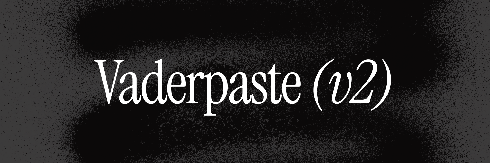

# Vaderpaste V2

<div align="center">
  
  <p><em>A (bad coded) csgo styled ui library for Roblox executors</em></p>
  
  
</div>

## Table of Contents

- [Installation](#installation)
- [Quick Start](#quick-start)
- [API Reference](#api-reference)
  - [Window](#window)
  - [Tab](#tab)
  - [Section](#section)
  - [Toggle](#toggle)
  - [Dropdown](#dropdown)
  - [Slider](#slider)
  - [Colorpicker](#colorpicker)
  - [Keybind](#keybind)
  - [Hitpart Selector](#hitpart)
- [Examples](#examples)

## Disclaimer

⚠️ The original owner of this GUI is [i77lhm](https://github.com/i77lhm).

## Installation

Load the library directly from the repository:

```lua
local library = loadstring(game:HttpGet("https://raw.githubusercontent.com/HSp4m/vaderpaste/refs/heads/main/library.lua"))()
local flags = library.flags -- Access flags from here
```

## Quick Start

Here's a basic example to get you started:

```lua
-- Load the library
local library = loadstring(game:HttpGet("https://raw.githubusercontent.com/HSp4m/vaderpaste/refs/heads/main/library.lua"))()
local flags = library.flags

-- Create a window
local window = library:window({
    name = "My Script",
    size = UDim2.fromOffset(500, 650)
})

-- Create a tab
local tab = window:tab({name = "Main"})

-- Create a section
local section = tab:section({name = "Features"})

-- Add a toggle
section:toggle({
    name = "Enable Feature",
    flag = "feature_enabled",
    default = false,
    callback = function(enabled)
        print("Feature toggled:", enabled)
    end
})
```

## API Reference

### Window

Creates the main window container for your UI.

```lua
local window = library:window({
    name = "Window Title",           -- String: Title displayed in the window
    size = UDim2.fromOffset(500, 650) -- UDim2: Window dimensions (width, height)
})
```

### Tab

Creates a tab within the window for organizing different sections.

```lua
local tab = window:tab({
    name = "Tab Name"  -- String: Name displayed on the tab
})
```

### Section

Creates a section within a tab to group related elements.

```lua
local section = tab:section({
    name = "Section Name"  -- String: Section header text
    side = "left"          -- String: Side of the section "left" or "right"
})
```

### Toggle

Creates a toggle switch element.

```lua
section:toggle({
    name = "Toggle Name",      -- String: Display name
    flag = "toggle_flag",      -- String: Unique identifier for accessing value
    default = false,           -- Boolean: Initial state
    enabled = true,            -- Boolean: Whether the toggle is interactable (optional)
    callback = function(state) -- Function (boolean): Called when toggled
        print("Toggle state:", state)
        print("Flag value:", flags["toggle_flag"])
    end
})
```

### Dropdown

Creates a dropdown selection element.

```lua
section:dropdown({
    name = "Dropdown Name",           -- String: Display name
    flag = "dropdown_flag",           -- String: Unique identifier
    items = {"Option 1", "Option 2"}, -- Table: Available options
    multi = false,                    -- Boolean: Allow multiple selections
    callback = function(selected)     -- Function: Called when selection changes
        print("Selected:", selected)
        print("Flag value:", flags["dropdown_flag"])
    end
})
```

### Slider

Creates a numeric slider element.

```lua
section:slider({
    name = "Slider Name",        -- String: Display name
    flag = "slider_flag",        -- String: Unique identifier
    suffix = "%",                -- String: Unit suffix (optional)
    default = 50,                -- Number: Initial value
    min = 0,                     -- Number: Minimum value
    max = 100,                   -- Number: Maximum value
    interval = 1,                -- Number: Step size
    callback = function(value)   -- Function (number): Called when value changes
        print("Slider value:", value)
        print("Flag value:", flags["slider_flag"])
    end
})
```

### Colorpicker

Creates a color selection element.

```lua
-- Standalone colorpicker
section:colorpicker({
    name = "Color Name",              -- String: Display name
    flag = "color_flag",              -- String: Unique identifier
    color = Color3.new(1, 1, 1),      -- Color3: Initial color
    callback = function(color, alpha) -- Function (Color3): Called when color changes
        print("Color:", color, "Alpha:", alpha)
        print("Flag color:", flags["color_flag"].Color)
        print("Flag transparency:", flags["color_flag"].Transparency)
    end
})

-- Colorpicker attached to toggle
section:toggle({...})
section:colorpicker({
    -- Remove the 'name' attribute
    flag = "toggle_color_flag",
    color = Color3.new(1, 0, 0),
    callback = function(color, alpha)
        -- Handle color change
    end
})
```

### Keybind

Creates a keybind element for keyboard shortcuts.

```lua
-- Standalone keybind
section:keybind({
    name = "Keybind Name",           -- String: Display name
    flag = "keybind_flag",           -- String: Unique identifier
    default = Enum.KeyCode.F,        -- KeyCode: Initial key (optional)
    display = "Toggle Feature",      -- String: Display name in keybind list
    callback = function(active)      -- Function (boolean): Called when key is pressed
        print("Keybind active:", active)
        print("Flag active:", flags["keybind_flag"].active)
        print("Current keybind:", flags["keybind_flag"].key)
    end
})

-- Keybind attached to toggle
section:toggle({...})
section:keybind({
    -- Remove the 'name' attribute
    flag = "toggle_keybind_flag",
    default = Enum.KeyCode.G,
    display = "Toggle via hotkey",
    callback = function(active)
        -- Handle keybind activation
    end
})
```

### Hitpart

Creates a hitpart selector element.

```lua
-- Multi Hitpart Selector

section:hitpart_picker({
	name = "Multihitpart Picker",     -- String: Display Name
	side = "left",                    -- String: "left" or "right"
	flag = "multihitpart_picker",     -- String: Unique identifier
	default = { "Head" },             -- Table: Default selected parts
	multi = true,                     -- Boolean: Allow multiple selections
	type = "R6",                      -- String: "R6" or "R15"
	callback = function(parts)        -- Function (table): Called when user selects a part (Always returns a table)
		table.foreach(parts, print)
	end,
})

-- Single Hitpart Selector

section:hitpart_picker({
	name = "Singlehitpart Picker",     -- String: Display Name
	side = "left",                     -- String: "left" or "right"
	flag = "singlehitpart_picker",     -- String: Unique identifier
	default = { "Head" },              -- Table: Default selected part
	multi = false,                     -- Boolean: Allow multiple selections
	type = "R15",                      -- String: "R6" or "R15"
	callback = function(parts)         -- Function (table): Called when user selects a part (Always returns a table)
		table.foreach(parts, print)
	end,
})
```

## Examples

### Complete Example

The full example can be found [here](example.lua)
